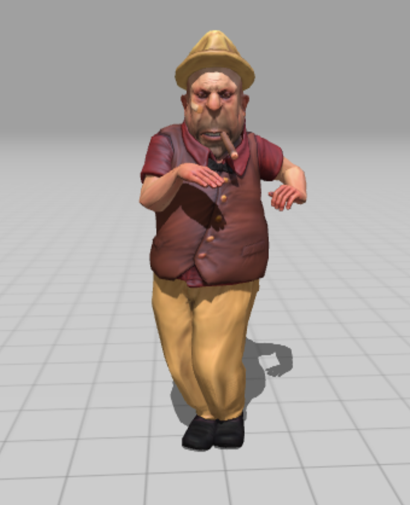
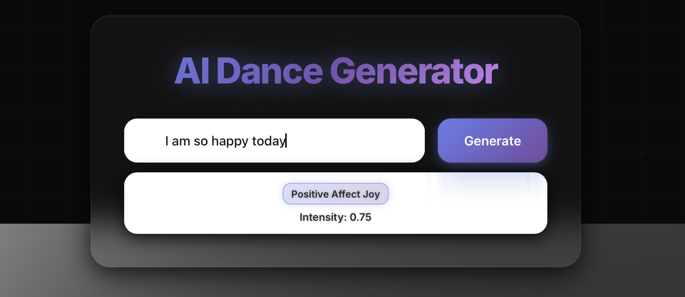

# AI Dance Generator

A cutting-edge AI-powered dance generation platform that analyzes text emotions and creates personalized 3D character dances in real-time.

## Features

- Real-time Emotion Analysis: Advanced RoBERTa-based multi-label emotion classification
- 3D Character Animation: Dynamic dance animations based on detected emotions
- Multi-User Support: Each user gets their own isolated experience
- Responsive Design: Optimized for all devices with futuristic UI
- Intensity Prediction: SVR model for emotion intensity scoring

## Live Project

**DanceAI:** [App Deployment](https://dancingai.netlify.app)

## Deployment Details

- **Frontend** is deployed on Netlify. The code is in the `frontend/` folder and uses React with React Three Fiber for 3D rendering. The environment variable `REACT_APP_API_URL` is set to point to the backend Render URL.
- **Backend** is deployed on Render (or can be run on AWS EC2). The code is in the `backend/` folder and uses Flask to serve the API. The backend loads models directly from HuggingFace at runtime.
- **Models** are not stored locally. The RoBERTa emotion classifier and SVR intensity regressor are hosted on HuggingFace Hub and loaded dynamically by the backend.

## Model Information

### RoBERTa Emotion Classification Model
- Base Model: `roberta-base` (125M parameters)
- Task: Multi-label classification (6 emotion categories)
- Training Data: GoEmotions dataset with 6 macro-emotion categories
- Models are hosted on HuggingFace: [RoBERTa Model](https://huggingface.co/anishdhandore/RoBERTa_text_classification)

### SVR Intensity Model
- Support Vector Regression for emotion intensity
- Hosted on HuggingFace: [SVR Model](https://huggingface.co/anishdhandore/SVR_text_intensity)

## Model Performance

### RoBERTa Emotion Classification Model
- **Overall Accuracy:** 86.6%
- **Hamming Loss:** 0.134
- **Jaccard Score:** 0.498
- **Training Efficiency:**
  - ~486 samples/sec, ~65 seconds per epoch, total training time ~1.5 hours

### SVR Intensity Model
- **Test Set MAE (Mean Absolute Error):** 0.1551
- **Test Set RMSE (Root Mean Squared Error):** 0.1922
- **Test Set Pearson Correlation:** 0.4773

## Technical Architecture

### Frontend
- React.js with Three.js for 3D rendering
- Modern CSS with glassmorphism effects
- Responsive design optimized for all devices
- Real-time animations with smooth transitions

### Backend
- Flask API for model inference
- Transformers library for RoBERTa model
- Scikit-learn for SVR intensity prediction
- CORS enabled for cross-origin requests

## Screenshots

## Use Cases

- Entertainment: Interactive dance experiences
- Emotion Recognition: Real-time sentiment analysis
- Creative Expression: Visual representation of emotions
- Educational: Understanding emotion-text relationships

## Technologies Used

- Frontend: React, Three.js, CSS3
- Backend: Flask, Python
- ML: Transformers, PyTorch, Scikit-learn
- 3D Models: GLB format with Mixamo animations
- Deployment: Netlify (frontend), Render/AWS EC2 (backend)

---

*Powered by state-of-the-art AI models and modern web technologies.* 